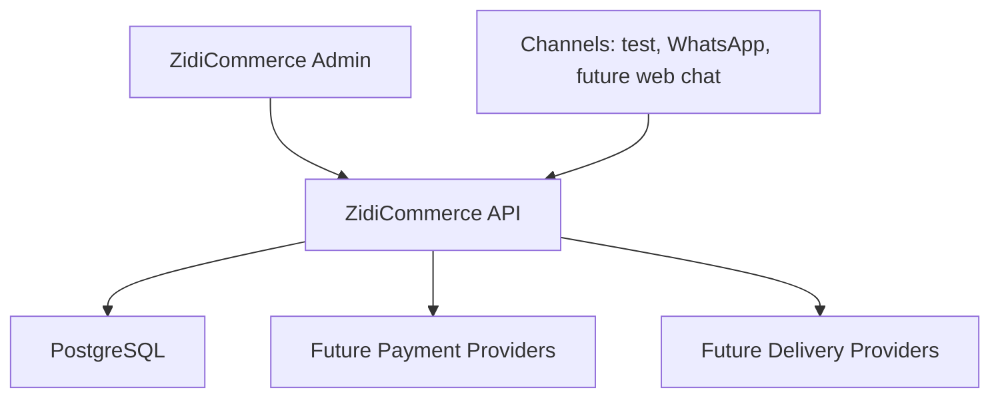
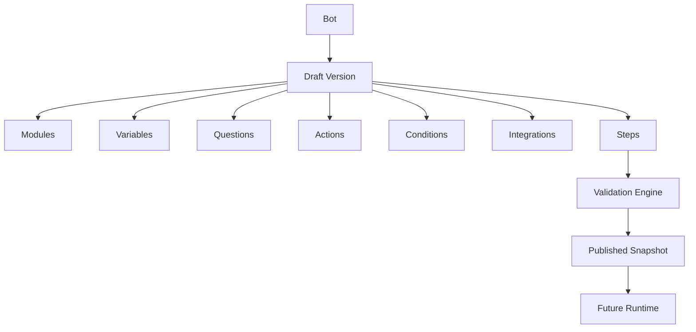
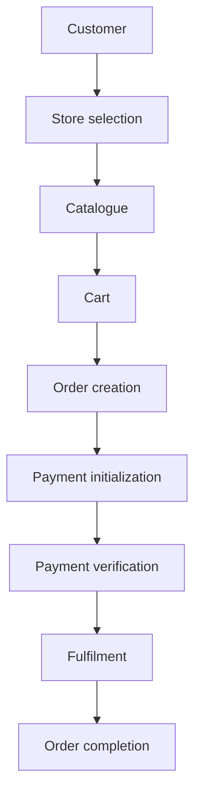
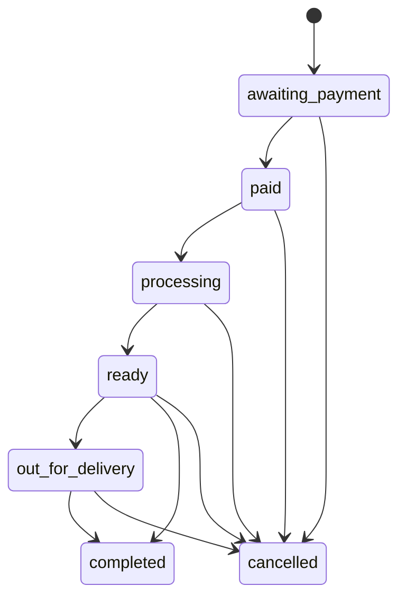
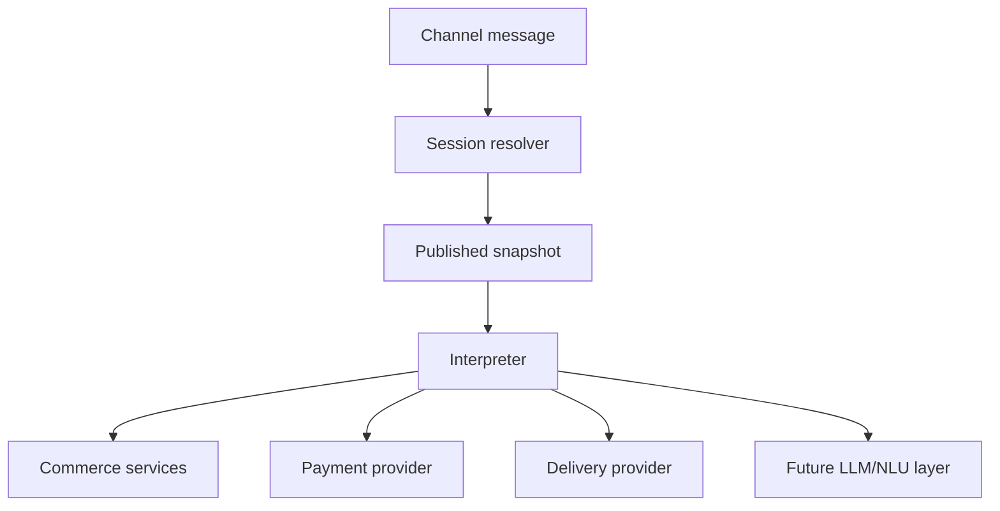

# ZidiCommerce Architecture

## Purpose

ZidiCommerce is a separate commerce platform in the Zidi ecosystem. Existing Zidi remains responsible for campaigns, rewards, surveys, CRM, and legacy workflows. ZidiCommerce owns commerce operations and will later own configurable commerce bots.

## System Shape



The first phase is intentionally a modular monolith. There are no unnecessary microservices.

## Repository Structure

```text
apps/
  api/
    cmd/api/
    internal/
      auth/
      authz/
      bot/
      commerce/
      config/
      database/
      httperror/
      httpapi/
      migrations/
      organization/
      tenant/
  admin/
packages/
  shared/
migrations/
configs/
docs/
```

## Backend Boundaries

The API is organized around domain packages. Phase 1 implements only foundation behavior:

- `auth`: JWT issuing, parsing, login service, current user context
- `authz`: role definitions and policy helpers
- `tenant`: reusable organization-scoped access pattern
- `organization`: organization and user persistence foundation
- `commerce/*`: package boundaries for stores, catalogue, inventory, customers, orders, payments, fulfilment, and channels
- `bot`: configuration-driven Bot Builder models, validation, publish snapshots, and admin APIs

## Database Strategy

Production schema changes are handled by explicit SQL migrations in `/migrations`. The API runs pending migrations at startup.

`AutoMigrate()` is not used as the production migration mechanism.

The first migration creates:

- organizations
- users
- stores
- store user assignments
- catalogue categories
- products
- product variants
- product images
- inventory levels
- customers
- carts
- orders
- order items
- payments
- fulfilments
- channels

## Tenant Model

Organization is the tenant boundary. Commerce records include `organization_id` where applicable. Service and repository code should construct a `tenant.Scope` from the authenticated user and apply it to tenant-owned queries.

The frontend must not be trusted as the only tenant boundary.

## Authentication

Authentication uses signed JWT access tokens. Claims include:

- user ID
- organization ID
- role
- issuer
- expiry

`/v1/auth/login` validates email/password against the users table and returns an access token.

## Authorization

Roles are defined centrally in `internal/authz`:

- `platform_admin`
- `merchant_admin`
- `store_manager`
- `store_staff`
- `support_agent`
- `viewer`

Handlers must use policy middleware/helpers rather than scattering role strings.

## Commerce Domains

Commerce domains are intentionally separated:

- Store
- Catalogue
- Inventory
- Customer
- Order
- Payment
- Fulfilment
- Channel

Phase 2 makes the commerce domains usable through API services. Phase 3 adds organization onboarding, membership, invitation, store access, and audit foundations. Phase 4 adds Bot Builder configuration. Phase 5 adds a deterministic runtime that consumes published snapshots and orchestrates commerce services instead of owning commerce business logic.

## Bot Builder

Phase 4 introduces configurable bot entities without executing WhatsApp, payments, order placement, delivery, or LLM behavior.



The builder stores:

- `bots`: organization-owned assistant definitions and the active published version pointer
- `bot_versions`: mutable draft/validated versions and immutable published/archived versions
- `bot_version_modules`: reusable capability modules such as order, catalogue, FAQ, complaint, support, and store locator
- `bot_variables`: typed values collected or produced during a future conversation
- `bot_questions`: reusable prompts and expected response modes
- `bot_actions`: declarative references to commerce/system actions
- `bot_conditions`: rule groups used by future runtime branching
- `bot_integrations`: provider requirements and non-secret integration metadata
- `bot_steps`: ordered conversation graph nodes
- `bot_published_snapshots`: immutable JSON snapshots used as the future runtime contract

Published versions are not editable. To change a live bot, create a new draft from the published version, edit the draft, validate, then publish a new immutable snapshot.

Integrations intentionally reject plaintext secret-like keys in configuration. Runtime credentials should remain in service-level environment variables or a future secret store.

## Organization Membership

The legacy `users.organization_id` remains for compatibility, but Phase 3 introduces `organization_memberships` as the forward path. Authentication prefers the first active membership, ordered by owner status and creation date. This supports future multi-organization membership without breaking existing JWT issuing.

New merchants register first as unaffiliated users. They then create an organization through onboarding and become the owner `merchant_admin` through an organization membership.

## Store Access

`store_user_assignments` is the store boundary for `store_manager` and `store_staff`. Merchant admins keep organization-wide access. Store-scoped users only see and operate assigned stores through backend joins; frontend filtering is not considered an authorization boundary.

## Invitations

Organization invitations use cryptographically secure random tokens. Only a SHA-256 token hash is stored. Invitations expire, are single-use, and cannot grant `platform_admin`. Raw tokens are not serialized from invitation models or returned from invite API responses.

## Audit Logs

Phase 3 adds `audit_logs` for administrative actions such as organization creation/update, member invitations, member joins, role changes, deactivation, and store access updates. Audit metadata must not contain secrets.

## Commerce Flow



## Order State Machine

Allowed transitions:



The frontend cannot mutate order status directly. It must call `POST /v1/orders/:id/transition`.

## Inventory Safety

Order creation runs in a database transaction. Inventory rows are locked before stock is decremented. The service checks available stock and rejects orders that would make inventory negative.

The backend always resolves product prices from the database. Client-supplied totals and prices are ignored.

## Payment Boundary

Payments use a provider abstraction. Phase 2 includes:

- a safe `test` provider for local development and automated tests
- a Paystack provider implementation that is used only when `PAYMENT_PROVIDER=paystack` and `PAYSTACK_SECRET_KEY` are configured

Payment verification is authoritative and idempotent. A frontend success flag is not enough to mark an order as paid.

## Bot Runtime

The runtime consumes published snapshots:



Runtime policy:

- new sessions use the current published snapshot
- active sessions stay pinned to the version they started with
- completed, expired, or cancelled sessions reset to the current published version only when the customer sends a reset/start trigger
- draft bot versions are never executed

Runtime state lives in `conversation_sessions`, `conversation_messages`, `processed_messages`, and `runtime_events`.

See [runtime.md](./runtime.md) for the detailed runtime architecture.

## Existing Zidi Reuse

Reused concepts:

- Go, Fiber, PostgreSQL, GORM
- SQL migration direction
- organization-scoped commerce data
- JWT-style authentication
- commerce roles
- service/repository boundary style

Not reused:

- Lush Institution flow
- hardcoded merchant seed logic
- hardcoded CORS/domain lists
- legacy campaign/reward handlers
- in-memory WhatsApp bot sessions
- payment/email utilities from the monolith
