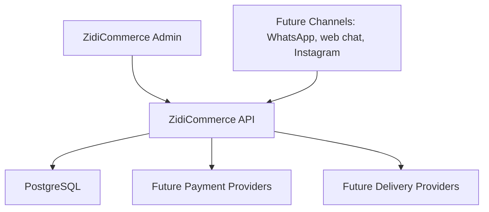
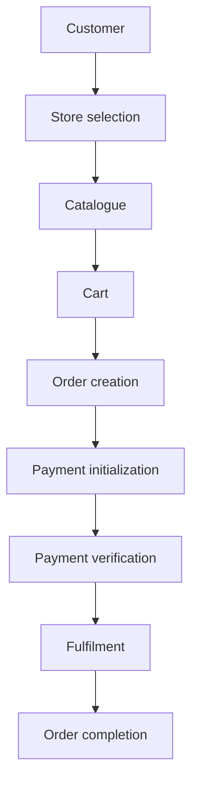
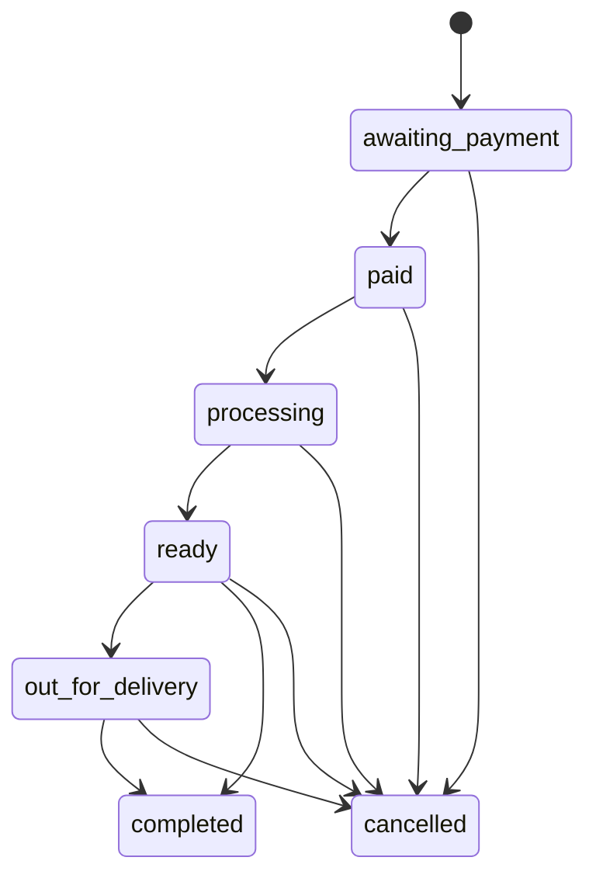
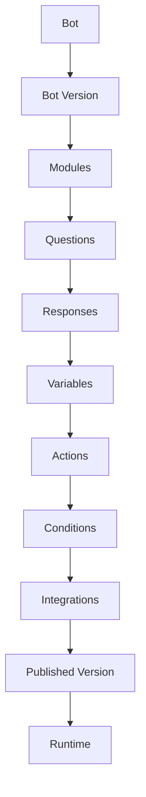

# ZidiCommerce Architecture

## Purpose

ZidiCommerce is a separate commerce platform in the Zidi ecosystem. Existing Zidi remains responsible for campaigns, rewards, surveys, CRM, and legacy workflows. ZidiCommerce owns commerce operations and will later own configurable commerce bots.

## System Shape



The first phase is intentionally a modular monolith. There are no unnecessary microservices.

## Repository Structure

```text
apps/
  api/
    cmd/api/
    internal/
      auth/
      authz/
      bot/
      commerce/
      config/
      database/
      httperror/
      httpapi/
      migrations/
      organization/
      tenant/
  admin/
packages/
  shared/
migrations/
configs/
docs/
```

## Backend Boundaries

The API is organized around domain packages. Phase 1 implements only foundation behavior:

- `auth`: JWT issuing, parsing, login service, current user context
- `authz`: role definitions and policy helpers
- `tenant`: reusable organization-scoped access pattern
- `organization`: organization and user persistence foundation
- `commerce/*`: package boundaries for stores, catalogue, inventory, customers, orders, payments, fulfilment, and channels
- `bot`: placeholder boundary for the future configuration-driven bot platform

## Database Strategy

Production schema changes are handled by explicit SQL migrations in `/migrations`. The API runs pending migrations at startup.

`AutoMigrate()` is not used as the production migration mechanism.

The first migration creates:

- organizations
- users
- stores
- store user assignments
- catalogue categories
- products
- product variants
- product images
- inventory levels
- customers
- carts
- orders
- order items
- payments
- fulfilments
- channels

## Tenant Model

Organization is the tenant boundary. Commerce records include `organization_id` where applicable. Service and repository code should construct a `tenant.Scope` from the authenticated user and apply it to tenant-owned queries.

The frontend must not be trusted as the only tenant boundary.

## Authentication

Authentication uses signed JWT access tokens. Claims include:

- user ID
- organization ID
- role
- issuer
- expiry

`/v1/auth/login` validates email/password against the users table and returns an access token.

## Authorization

Roles are defined centrally in `internal/authz`:

- `platform_admin`
- `merchant_admin`
- `store_manager`
- `store_staff`
- `support_agent`
- `viewer`

Handlers must use policy middleware/helpers rather than scattering role strings.

## Commerce Domains

Commerce domains are intentionally separated:

- Store
- Catalogue
- Inventory
- Customer
- Order
- Payment
- Fulfilment
- Channel

Phase 2 makes the commerce domains usable through API services. The future bot runtime should orchestrate these services instead of owning commerce business logic.

## Commerce Flow



## Order State Machine

Allowed transitions:



The frontend cannot mutate order status directly. It must call `POST /v1/orders/:id/transition`.

## Inventory Safety

Order creation runs in a database transaction. Inventory rows are locked before stock is decremented. The service checks available stock and rejects orders that would make inventory negative.

The backend always resolves product prices from the database. Client-supplied totals and prices are ignored.

## Payment Boundary

Payments use a provider abstraction. Phase 2 includes:

- a safe `test` provider for local development and automated tests
- a Paystack provider implementation that is used only when `PAYMENT_PROVIDER=paystack` and `PAYSTACK_SECRET_KEY` are configured

Payment verification is authoritative and idempotent. A frontend success flag is not enough to mark an order as paid.

## Future Bot Architecture

The future bot platform will be configuration-driven:



No Bot Builder or runtime is implemented in Phase 1 or Phase 2.

## Existing Zidi Reuse

Reused concepts:

- Go, Fiber, PostgreSQL, GORM
- SQL migration direction
- organization-scoped commerce data
- JWT-style authentication
- commerce roles
- service/repository boundary style

Not reused:

- Lush Institution flow
- hardcoded merchant seed logic
- hardcoded CORS/domain lists
- legacy campaign/reward handlers
- in-memory WhatsApp bot sessions
- payment/email utilities from the monolith
