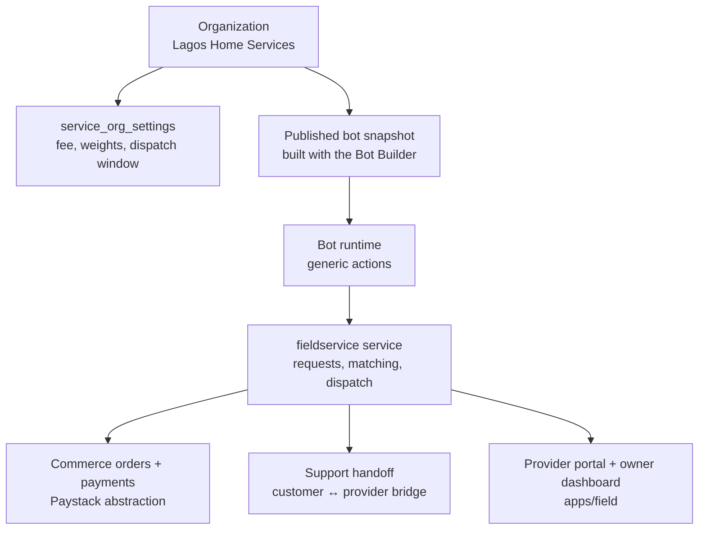
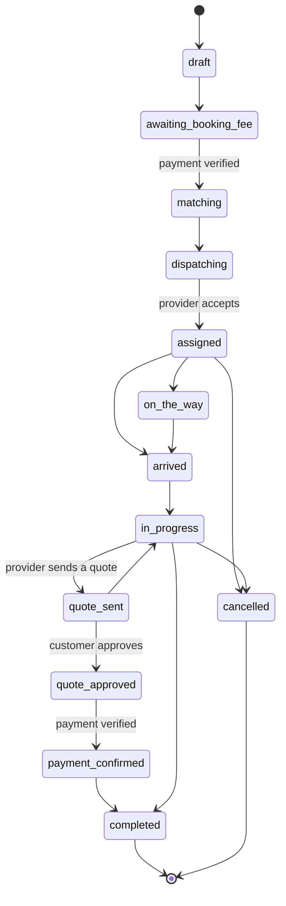

# Field service (home services / handyman) on ZidiCommerce

This is a **tenant workflow**, not a second product. Bing Chun and the other
commerce organizations are unchanged, and nothing here is hardcoded into the
generic runtime.



## What is reused, not rebuilt

| Capability | Comes from |
|---|---|
| Tenancy, users, memberships, JWT auth | `organization`, `auth`, `authz` (plus a `service_provider` role) |
| WhatsApp inbound/outbound, sessions, handoff | `runtime` — no second integration |
| Booking fee and quote payments | `commerce/core` orders + payments + Paystack provider |
| Background retries and dispatch timeouts | `jobs` |
| Audit trail | `organization.AuditLog` |
| Customers | `commerce/core` customers |

## What this module adds

Package `apps/api/internal/fieldservice`:

- Organization-configurable service pools, providers, matching weights, booking
  fee, and dispatch window (`service_org_settings`)
- A deterministic matching engine scoring service fit, availability, distance,
  rating, experience, and current workload
- Sequential provider dispatch with an acceptance window, decline and timeout
  fallback
- Quotes, quote items, ratings, and a customer↔provider message bridge
- Owner and provider APIs under `/v1/field/*`

The conversation itself is a Bot Builder template
(`bot.CreateServiceBookingBot`) published as an ordinary immutable snapshot. The
runtime gains six generic actions via `runtime.RegisterFieldService`:
`get_service_welcome`, `list_service_pools`, `select_service_pool`,
`create_service_request`, `initialize_booking_fee`, `check_booking_payment`,
and `submit_service_rating`.

UIs live in `apps/field` (port **3010**) and are deliberately separate from the
commerce admin: the owner sees the business, the provider sees their jobs.

## Job state machine

Transitions are validated server-side. A provider cannot skip work states, and a
finished job cannot be completed twice.



Only the business can cancel a job. `quote_sent`, `quote_approved`, and
`payment_confirmed` are reached by the quote and payment paths, never by a
provider-driven status update.

## Who may do what

- **Providers** see a redacted request until they accept: service, area, problem,
  and the acceptance deadline — never the customer's name, phone, or address.
- **Approving or declining a quote is the customer's decision.** It is reachable
  from WhatsApp and from the owner dashboard; a provider is refused.
- **Ratings** come from the customer side and only after the job is completed.
- **Payment state is never trusted from a client.** A booking fee or quote is
  only settled by `commerce.VerifyPayment` / the Paystack webhook, which calls
  back into `OnPaymentPaid`.

## Matching

```text
score = 100 × ( w_service      × service_fit
              + w_availability × availability × workload_factor
              + w_distance     × proximity
              + w_rating       × rating/5
              + w_experience   × min(jobs/50, 1) )
```

`workload_factor = 1 / (1 + active_jobs)`, so a busy provider is penalised
through the availability term. Weights default to 40/20/20/15/5 and are stored
per organization, editable in **Settings**. Providers who do not offer the
service, are inactive, are offline, or are beyond the configured radius without
an overlapping service area are excluded rather than scored.

Every candidate's breakdown is persisted in `service_matches.breakdown` and shown
in the owner dashboard under a job, which is what makes a pilot debuggable:

```text
1. John Adeyemi   99.3%   service 40 | avail 20.0 | dist 20.0 (0.0km) | rating 15.0 | exp 4.3
2. Daniel Wright  95.7%   service 40 | avail 20.0 | dist 16.3 (4.6km) | rating 14.4 | exp 5.0
```

The customer never sees this ranking.

## Demo seed

From the repo root, with the API database configured:

```bash
cd apps/api && go run ./cmd/seed-fieldservice
```

It creates the organization **Lagos Home Services** (`lagos-home-services`) with:

- 8 service categories and 20 handymen spread across Lagos, with realistic
  ratings, experience, and availability
- 6 sample customers and 6 requests covering the whole lifecycle — awaiting the
  booking fee, dispatching, in progress, quote sent, and two completed and rated
- Sample conversations, quotes, payments, and audit history
- A **draft** WhatsApp channel ready for Meta credentials, and an **active test
  channel** so the bot simulator works immediately

| Account | Email | Password |
|---|---|---|
| Owner | `owner@lagoshome.demo` | `HomeServices1!` |
| Sample provider (John, Lekki plumber) | `john-lekki@providers.zidicommerce.local` | `HomeServices1!` |

Every provider's portal login is `<public-code>@providers.zidicommerce.local`
with the same password. The seed is idempotent — rows are matched by slug,
public code, email, and (for sample jobs) customer + service + description, so
running it twice changes nothing.

Then:

```bash
npm run dev:field   # http://localhost:3010
```

### Seeding a deployed environment

The seeder is also reachable from the API itself, which is how the Railway
pilot is provisioned (the managed database has no public endpoint). Set on the
API service:

| Variable | Purpose |
|---|---|
| `FIELD_SERVICE_DEMO_SEED` | `true` runs the seed once at startup |
| `FIELD_SERVICE_DEMO_PASSWORD` | Password for the seeded owner and provider logins. **Always set this outside local development** — otherwise the built-in development default is used |
| `FIELD_SERVICE_PORTAL_URL` | Provider portal link included in dispatch notifications |

The seed runs after migrations, is idempotent across redeploys, is scoped to its
own organization, and never fails API startup. The password is never written to
the logs — only its source. Once the tenant exists you can set
`FIELD_SERVICE_DEMO_SEED=false`; leaving it on is harmless but does work on
every boot.

## Running the demo

1. **Customer** messages the WhatsApp number, or the bot simulator in Admin.
   `Hey` opens the welcome and the service menu.
2. Choose a service by number or name, then answer name, area, address, problem,
   and preferred time.
3. The bot shows a summary and the booking fee, and sends a Paystack link.
   Reply **I have paid** once the payment goes through.
4. Matching runs, the top provider is notified, and they accept in the portal.
5. The conversation becomes a handoff: the customer keeps using WhatsApp, the
   provider replies from the portal. The customer never gets the provider's
   personal number.
6. The provider updates status, then submits a quote. The customer receives it on
   WhatsApp and replies **APPROVE & PAY**, **DECLINE**, or asks a question.
7. After payment is verified the provider completes the job and the customer
   rates 1–5. The rating feeds future matching.
8. The owner sees the whole lifecycle, the matching breakdown, conversations,
   payments, and audit log in the dashboard.

The acceptance window defaults to 120 seconds. For a hands-on walkthrough raise
it in **Settings → Acceptance window** so a job does not time out mid-demo.

## Connecting real WhatsApp

The seeded WhatsApp channel is deliberately in draft. Add the Meta phone number
id, access token, and webhook secret in the commerce admin, set the channel
active, and point the Meta webhook at `POST /v1/runtime/webhooks/whatsapp`.
Until then the test channel records what would have been sent, so nothing is
silently lost.

## API surface

All routes are organization-scoped and require authentication.

| Route | Who |
|---|---|
| `GET/PUT /v1/field/settings` | owner (PUT), anyone in the org (GET) |
| `GET /v1/field/overview` | owner |
| `GET/POST /v1/field/pools` | owner (POST) |
| `GET/POST /v1/field/providers` | owner (POST) |
| `POST /v1/field/providers/:id/availability` | owner, or the provider themselves |
| `GET /v1/field/requests`, `/:id`, `/:id/messages` | owner; providers see their own |
| `GET /v1/field/requests/:id/matches` | owner — the scoring breakdown |
| `POST /v1/field/requests/:id/status` | assigned provider, or owner |
| `POST /v1/field/requests/:id/quotes` | assigned provider, or owner |
| `POST /v1/field/quotes/:id/approve` / `decline` | customer side — providers refused |
| `GET /v1/field/inbox`, `/home` | provider |
| `POST /v1/field/dispatch/:id/accept` / `decline` | the notified provider |
| `GET /v1/field/conversations`, `/transactions` | owner |
| `POST /v1/field/requests/:id/take-over` / `release` / `close` | owner |

## Tests

```bash
cd apps/api
go test ./internal/fieldservice/...
```

Covers service selection, customer creation, location handling, the booking fee,
matching and ranking (including configurable weights), provider availability,
acceptance, decline, timeout, the acceptance race, assignment, human handoff and
conversation routing, quote creation, approval authorization, expiry, payment,
payment verification idempotency, job completion, the state machine, ratings,
tenant isolation, public-code uniqueness, and seed idempotency.
