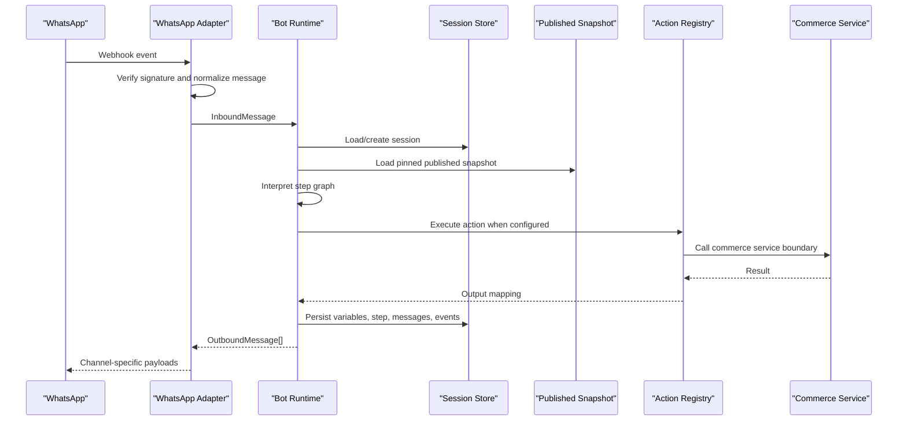

# ZidiCommerce Bot Runtime

Phase 5 adds a deterministic runtime engine that executes immutable published Bot Builder snapshots.

The runtime is separate from:

- Bot Builder configuration screens
- WhatsApp or any other channel payload format
- Commerce storage tables
- LLM or natural-language orchestration

## Runtime Flow



## Session Model

`conversation_sessions` persists:

- organization, bot, bot version, channel and optional customer
- external conversation ID
- current step and expected input
- status: `active`, `completed`, `handoff`, `expired`, `cancelled`
- variables and system context
- optimistic `lock_version`
- last activity and expiry timestamps

Uniqueness is enforced by:

```text
organization_id + channel_id + external_conversation_id
```

This survives application restarts and multiple API instances.

## Version Pinning

New conversations use the bot version currently published for the resolved channel/organization.

Existing active conversations stay pinned to the published version they started with. If a merchant publishes a new version while a customer is mid-flow, that customer continues on the old immutable snapshot until completion, handoff, cancellation, expiry, or reset.

If a completed/expired/cancelled conversation receives `start`, `restart`, `reset`, `hi`, `hello`, or `menu`, the same external conversation record is reset to the current published version.

## Snapshot Loading

Runtime execution uses only `bot_published_snapshots.snapshot`.

It does not read draft bot builder rows at execution time. Draft versions are ignored until they are validated and published into a new immutable snapshot.

## Interpreter

Supported step types:

- `message`
- `question`
- `choice`
- `module`
- `condition`
- `action`
- `handoff`
- `end`

The interpreter is deterministic. It executes automatic steps until it reaches a question, handoff, end step, or controlled runtime error.

## Variables

Runtime variables are stored in session JSON and resolved by safe paths:

```text
variables.customer_name
variables.cart_id
session.id
session.status
customer.name
```

Template rendering supports:

```text
Hi {{variables.customer_name}}
```

Missing variables use the published bot fallback configuration.

There is no arbitrary code or expression execution.

## Conditions

Conditions support safe operators:

- `equals`
- `not_equals`
- `contains`
- `greater_than`
- `less_than`
- `exists`
- `not_exists`
- `in`
- `not_in`

AND/OR combinators are supported from the Phase 4 condition model.

## Actions

The runtime uses an action registry. Current real commerce-backed actions:

- `get_store`
- `get_categories`
- `get_products`
- `get_inventory`
- `create_cart`
- `add_to_cart`
- `calculate_cart`
- `create_order`
- `initialize_payment`
- `get_order`
- `get_order_status`
- `handoff_to_agent`

Action inputs are resolved through configured mappings. Outputs are mapped back into session variables.

Commerce actions call `commerce/core.Service`; the runtime does not update commerce tables directly.

## Modules

Modules are reusable flow entry points. A module can define `entry_step` in its parameters. Entering a module records runtime events and routes execution to that entry step while preserving the session context.

This keeps module behavior generic rather than merchant-specific.

## Channels

Runtime uses channel-neutral models:

- `InboundMessage`
- `OutboundMessage`
- `MessageOption`
- `Location`

The test/simulator channel is authenticated and uses the real runtime engine.

The WhatsApp adapter:

- verifies webhook setup tokens against active channel configuration
- requires `X-Hub-Signature-256` for public POST webhooks
- fails closed if no `app_secret` is configured
- parses WhatsApp webhook payloads into generic inbound messages
- translates generic outbound messages into WhatsApp-shaped payloads

Conversation logic is not in the WhatsApp adapter.

## Idempotency

Inbound idempotency is enforced by `processed_messages`:

```text
organization_id + channel_id + external_message_id
```

Duplicate inbound messages return the stored runtime result and do not execute side effects again.

Order/payment actions also use deterministic idempotency keys derived from the runtime session unless a mapped idempotency key is supplied.

## Concurrency

Sessions use optimistic concurrency with `lock_version`. Persisting a result requires the expected session version. If another worker updates the session first, the runtime returns `SESSION_CONFLICT`.

This avoids holding database transactions across external provider calls.

## Errors

Structured runtime errors include:

- `BOT_NOT_FOUND`
- `NO_PUBLISHED_VERSION`
- `SESSION_NOT_FOUND`
- `INVALID_INPUT`
- `INVALID_STEP`
- `INVALID_VARIABLE`
- `ACTION_NOT_FOUND`
- `ACTION_FAILED`
- `INTEGRATION_NOT_CONFIGURED`
- `SESSION_CONFLICT`
- `RUNTIME_CONFIGURATION_ERROR`
- `CHANNEL_NOT_FOUND`
- `UNAUTHORIZED_WEBHOOK`

Customer-facing messages use safe fallback text and do not expose SQL errors, stack traces, provider secrets, tokens, or internal details.

## Runtime API

Authenticated simulator and visibility endpoints:

```text
POST /v1/runtime/test/start
POST /v1/runtime/test/message
GET  /v1/runtime/conversations
GET  /v1/runtime/conversations/:id
GET  /v1/runtime/conversations/:id/messages
```

Public WhatsApp endpoints:

```text
GET  /v1/runtime/webhooks/whatsapp
POST /v1/runtime/webhooks/whatsapp
```

The public POST requires a valid provider signature and active channel resolution.

## Observability

The runtime writes structured logs and persists `runtime_events` for:

- conversation start/completion
- message receipt
- step execution
- question presentation
- answer receipt
- action start/completion/failure
- module start/completion
- handoff
- runtime errors

Metrics are represented as event data and processing duration metadata for now. A dedicated metrics backend can be added later without changing runtime semantics.

## Limitations

- No LLM or AI intent detection yet.
- WhatsApp outbound sending is asynchronous through persisted outbound records and the background worker.
- Support operations are intentionally compact: conversation list, support tickets, claim, internal notes, and resolve.
- No Redis snapshot cache. Published snapshots are loaded from DB behind a clean service boundary.
- Module execution supports entry-step routing with a bounded nested call stack.
- Payment initialization is supported, but payment success still requires trusted provider verification.
